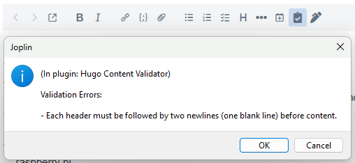

#  Joplin Hugo Validator

After finding [this blog post from Jack Adler](https://jalder.dev/posts/joplin-to-hugo/) about maintaining his Hugo blog from inside Joplin, I knew that I wanted to give it a try. However, most of his posts are just text, which means that only the front matter needs to be correct. I frequently use lots of formatting in my own posts, so it was important to make sure that the content I'm sending to Hugo is as valid as I can make it without having access to the Hugo binary.

## Usage

The validator adds a button to your edit pane that runs the following checks:

- valid YAML / JSON / TOML front matter
- no H1 headings
- no headings greater than 6
- two newlines between header and content
- images must have alt text

If no issues are found, a quick toast message is shown:

